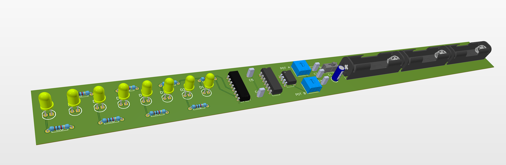
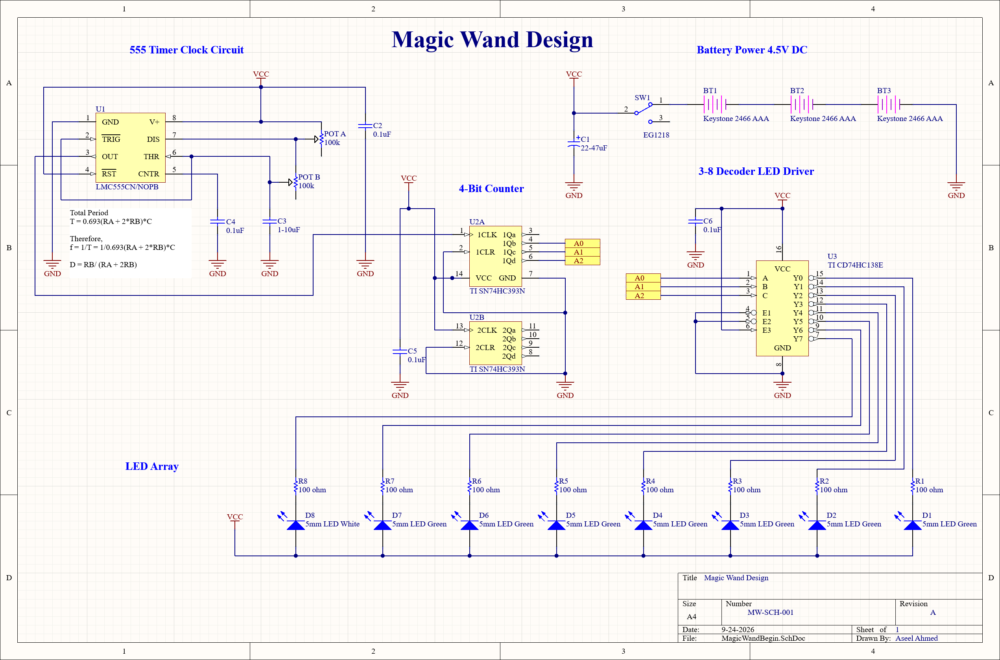
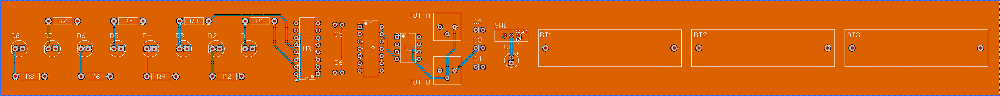
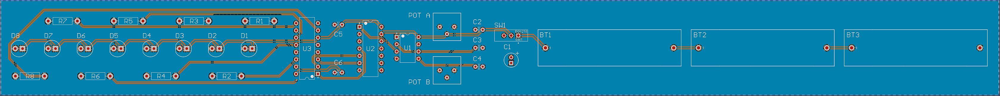

# Magic Wand LED Sequencer PCB

A battery-powered sequential LED circuit using a 555 timer, binary counter, and 3-to-8 decoder.

This project was completed as part of the *Crash Course Electronics and PCB Design* course and demonstrates clock generation, digital counting and decoding, schematic capture, PCB layout, routing, and preparation of PCB manufacturing files using Altium CircuitMaker.



---

## Overview

The Magic Wand circuit generates a sequential LED pattern using a combination of analog timing and digital logic.

A 555 timer generates the clock signal for the circuit. The clock pulses are counted using a binary counter, and the resulting binary output is passed to a 3-to-8 decoder.

The decoder activates the LEDs sequentially according to the counter state.

The project includes:

- 555 timer clock generator
- Adjustable timing components
- Binary counter
- 3-to-8 decoder
- Eight-LED output array
- 4.5 V battery power supply
- PCB layout and routing
- PCB 3D model
- Gerber files
- NC drill files

---

## Tools Used

- **Altium CircuitMaker**
- Schematic capture
- PCB layout and routing
- Component footprint assignment
- Design Rule Checking
- Gerber generation
- NC drill generation

---

## Circuit Architecture

The circuit consists of five main sections:

1. Battery power supply
2. 555 timer clock generator
3. Binary counter
4. 3-to-8 decoder
5. LED output array

The signal flow can be summarized as:

```text
555 Timer
    │
    │ Clock
    ▼
Binary Counter
    │
    │ Binary Output
    ▼
3-to-8 Decoder
    │
    ▼
8-LED Array
```

---

## Power Supply

The circuit is powered by three AAA batteries, providing approximately **4.5 V DC**.

The power section contains:

- Three AAA battery cells
- Main power switch
- Supply filtering capacitor
- VCC and ground distribution

The 4.5 V supply powers the timer, digital logic ICs, and LED array.

---

## 555 Timer Clock Generator

An **LMC555 timer** is used to generate the clock signal for the digital logic section.

The timer operates as an astable oscillator, continuously producing pulses while the circuit is powered.

The clock section includes adjustable resistance using potentiometers, allowing the timing characteristics of the oscillator to be changed.

The generated clock signal is supplied to the binary counter.

---

## Binary Counter

A **SN74HC393** binary counter receives the clock pulses from the 555 timer.

As each clock pulse arrives, the counter advances its binary state.

Three counter outputs are used as the address signals:

- A0
- A1
- A2

These three signals are connected to the inputs of the 3-to-8 decoder.

Using three binary signals allows eight different output states to be represented.

---

## 3-to-8 Decoder

A **74HC138 3-to-8 decoder** converts the three-bit binary counter value into eight individual output lines.

For each binary input combination, one decoder output is selected.

The decoder outputs are connected to the LED array, producing the sequential lighting pattern as the counter advances.

---

## LED Array

The output stage consists of eight LEDs.

Each LED has an individual current-limiting resistor.

The LED array contains:

- Seven green LEDs
- One white LED
- Eight individual current-limiting resistors

As the counter advances and the decoder changes state, the active LED moves through the array.

---

## Schematic

The complete schematic was created in Altium CircuitMaker.



The schematic contains the complete:

- Power supply
- 555 timer clock circuit
- Binary counter
- Decoder
- LED driver connections
- LED array

---

## PCB Design

After completing the schematic, the circuit was transferred to the PCB layout environment.

The PCB design process included:

- Component placement
- Footprint assignment
- Signal routing
- Power and ground routing
- Top and bottom copper layers
- Trace clearance verification
- Design Rule Checking
- 3D PCB inspection

### Top Layer



### Bottom Layer



---

## 3D PCB Model

The completed PCB was inspected using CircuitMaker's 3D visualization environment.


The 3D model provides a visual check of:

- Component placement
- Component orientation
- Connector and switch placement
- LED arrangement
- Component spacing
- Overall PCB layout

---

## Manufacturing Files

PCB manufacturing outputs were generated after completion of the layout.

The repository contains:

- Gerber files
- NC drill files

Gerber files:

`manufacturing/Gerber/`

NC drill files:

`manufacturing/NC_Drill/`

---

## Repository Structure

```text
magic-wand/
│
├── README.md
│
├── design_files/
│   ├── MagicWand_Schematic.SchDoc
│   └── MagicWandPCB.CMPcbDoc
│
├── manufacturing/
│   ├── Gerber/
│   └── NC_Drill/
│
└── images/
    ├── PCB_Schematic.png
    ├── TopLayerPCB.png
    ├── BottomLayerPCB.png
    └── PCB_3D.png
```

---

## Skills Demonstrated

- Electronic schematic capture
- 555 timer circuits
- Clock generation
- Digital logic fundamentals
- Binary counters
- Binary decoding
- LED driving
- Component and footprint selection
- PCB component placement
- PCB routing
- PCB layer management
- Design Rule Checking
- Gerber file generation
- NC drill file generation
- PCB manufacturing preparation

---

## Project Status

- [x] Schematic completed
- [x] PCB layout completed
- [x] PCB routing completed
- [x] Design Rule Check completed
- [x] 3D PCB model reviewed
- [x] Gerber files generated
- [x] NC drill files generated
- [ ] Physical PCB fabrication
- [ ] Hardware assembly and testing

---

## Project Context

This is a **course-guided project** completed as part of the
*Crash Course Electronics and PCB Design* course on Udemy.

The project provided hands-on experience with 555 timer circuits,
digital counters, decoder logic, PCB schematic capture, component
placement, routing, design verification, and PCB manufacturing
preparation using Altium CircuitMaker.
