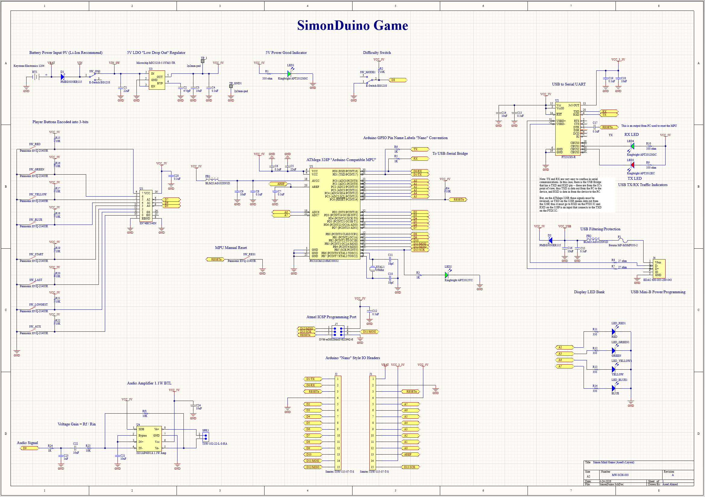

# SimonDuino Custom Electronics Design

A customized microcontroller-based Simon game hardware platform built around the ATmega328P.

The overall circuit architecture was derived from the SimonDuino project in the *Crash Course Electronics and PCB Design* course. For this implementation, the design was adapted for currently available components, revised pin assignments, modified interconnections, and a custom PCB layout currently under development.



---

## Overview

SimonDuino is an embedded electronics project combining user inputs, digital logic, a microcontroller, visual indicators, audio output, USB communication, and programming interfaces.

The current design includes:

- ATmega328P microcontroller
- Eight player/control push buttons
- 8-to-3 priority encoder
- Four game/display LEDs
- Audio amplifier and speaker output
- USB-to-UART interface
- USB programming connection
- ICSP programming header
- Arduino Nano-style I/O headers
- Difficulty/mode input
- Manual reset
- 9 V battery input
- Regulated 5 V power supply
- Power and communication indicators

The schematic is complete, while the custom PCB layout is currently under development.

---

## Project Adaptation

The circuit architecture originated from the course-guided SimonDuino project, but this implementation was modified to suit a new hardware configuration.

Adaptations include:

- Replacement of selected components with currently available alternatives
- Revision of component pin assignments
- Rewiring of affected schematic connections
- Integration of the selected replacement components into the circuit
- Custom organization of the schematic
- Development of a completely different PCB component arrangement and board layout

The PCB implementation will therefore differ from the course reference design.

---

## Tools Used

- **Altium CircuitMaker**
- Schematic capture
- Component selection
- Component and footprint research
- Pin mapping
- Digital circuit integration
- PCB design workflow
- Bill of Materials generation

---

## Circuit Architecture

The hardware is divided into several functional sections:

1. Power supply and regulation
2. Player input and encoding
3. ATmega328P microcontroller
4. Game/display LED outputs
5. Audio output stage
6. USB-to-UART communication
7. USB power/programming interface
8. ICSP programming interface
9. Arduino-style I/O expansion headers
10. Reset and mode controls

A simplified signal flow is:

```text
Player Buttons
      │
      ▼
8-to-3 Priority Encoder
      │
      ▼
ATmega328P Microcontroller
      │
      ├────────► Game LEDs
      │
      ├────────► Audio Amplifier ─────► Speaker
      │
      └────────► USB / Serial Interface
```

---

## Power Supply

The circuit is designed for a **9 V battery input**.

The power section includes:

- Battery connector
- Input protection diode
- Main power switch
- 5 V low-dropout regulator
- Supply filtering and decoupling capacitors
- 5 V power indicator LED
- VCC test point
- Ground test point

The regulated 5 V supply powers the microcontroller and the main peripheral circuitry.

---

## Player Input System

Eight push buttons provide the primary user and control inputs.

The inputs include:

- Red
- Green
- Yellow
- Blue
- Start
- Last
- Longest
- Auxiliary

Each switch includes a pull-up resistor.

Rather than connecting all eight switches directly to individual microcontroller inputs, the buttons are connected to an **SN74HC148 8-to-3 priority encoder**.

The encoder converts the button inputs into a three-bit digital output before passing the information to the microcontroller.

This reduces the number of microcontroller pins required for the input interface.

---

## ATmega328P Microcontroller

The central processing unit of the circuit is an **ATmega328P** microcontroller.

The microcontroller is responsible for interfacing with:

- Player controls
- Display LEDs
- Audio output
- USB serial communication
- Mode/difficulty input
- Programming interfaces

The design also includes:

- External 16 MHz crystal
- Crystal load capacitors
- Supply decoupling capacitors
- Analog reference filtering
- Manual reset
- Arduino-style GPIO naming

GPIO labels follow the familiar Arduino Nano convention to simplify firmware development and hardware interfacing.

---

## Difficulty / Mode Control

A dedicated switch provides an additional digital input for selecting the operating mode or difficulty setting.

The switch is interfaced directly with the microcontroller through the corresponding GPIO connection.

---

## Display LED Bank

Four LEDs provide the primary visual output for the game:

- Red
- Green
- Yellow
- Blue

Each LED has an individual current-limiting resistor and is controlled by the microcontroller.

These LEDs form the visual interface used for game sequences and player feedback.

---

## Audio Output

The design includes a dedicated audio output stage.

A microcontroller-generated audio signal is passed through signal-conditioning components before entering a **1.1 W bridge-tied-load audio amplifier**.

The amplifier drives the external speaker connection.

The audio section includes:

- Microcontroller audio signal
- Input filtering
- AC coupling
- Amplifier gain network
- Supply decoupling
- Speaker output connector

This provides audible feedback alongside the visual LED sequence.

---

## USB-to-UART Interface

A dedicated **FT231XS USB-to-serial UART bridge** provides communication between the computer and the ATmega328P.

The serial interface connects to the microcontroller's:

- TX line
- RX line
- Reset circuitry

The USB interface also includes:

- TX activity LED
- RX activity LED
- USB signal resistors
- Supply filtering
- Protection components
- USB Mini-B connector

The interface allows the microcontroller to communicate with a host computer through USB.

---

## Programming Interfaces

Two programming/interface methods are incorporated into the design.

### USB / Serial Interface

The FT231XS USB-to-UART bridge provides serial communication between the computer and the ATmega328P.

### ICSP Header

A dedicated Atmel ICSP header provides access to:

- MOSI
- MISO
- SCK
- RESET
- VCC
- GND

This allows direct in-system programming of the microcontroller.

---

## Arduino Nano-Style I/O Headers

Two I/O headers expose the microcontroller connections using an Arduino Nano-style pin arrangement.

The headers provide access to:

- Digital GPIO
- Analog inputs
- UART
- SPI
- Reset
- Power
- Ground
- Analog reference

This makes the hardware easier to interface with additional circuits and peripherals.

---

## Schematic Design

The complete schematic was created and customized in Altium CircuitMaker.


The schematic integrates:

- Battery power and voltage regulation
- ATmega328P microcontroller
- Player input encoder
- Push-button interface
- Game LEDs
- Audio amplifier
- Speaker output
- USB-to-UART communication
- USB connector
- TX/RX indicators
- ICSP programming
- Arduino-style expansion headers
- Manual reset
- Difficulty/mode control
- Supply filtering and decoupling

---

## Bill of Materials

A Bill of Materials was prepared for the adapted design and updated component selection.

The BOM is available at:

`manufacturing/BOM_SimonDuino_by_Aseel.xlsx`

---

## Repository Structure

```text
simon-duino-custom/
│
├── README.md
│
├── design_files/
│   └── SimonDuino.SchDoc
│
├── images/
│   └── PCB_Schematic.png
│
└── manufacturing/
    └── BOM_SimonDuino_by_Aseel.xlsx
```

Additional PCB and manufacturing files will be added as the project progresses.

---

## Skills Demonstrated

- Embedded hardware design
- ATmega328P circuit integration
- Schematic capture
- Component selection and substitution
- Datasheet-based pin mapping
- Schematic adaptation
- Digital input encoding
- Priority encoder integration
- Microcontroller GPIO interfacing
- USB-to-UART communication
- Serial communication hardware
- Audio amplifier integration
- Power supply design
- Voltage regulation
- Supply decoupling
- Programming interface design
- ICSP interfacing
- Bill of Materials preparation
- Altium CircuitMaker

---

## Project Status

- [x] Reference circuit architecture reviewed
- [x] Available component alternatives selected
- [x] Component pin mappings reviewed
- [x] Required connections rewired
- [x] Custom schematic completed
- [x] Bill of Materials prepared
- [ ] Custom PCB component placement
- [ ] PCB routing
- [ ] Design Rule Check
- [ ] 3D PCB review
- [ ] Gerber generation
- [ ] NC drill generation
- [ ] Physical PCB fabrication
- [ ] Hardware assembly and testing

---

## Project Context

The overall circuit architecture is based on the **SimonDuino** project from the *Crash Course Electronics and PCB Design* course on Udemy.

Unlike the earlier course-guided PCB exercises, this implementation has been adapted for a new hardware configuration.

Selected components were replaced with currently available alternatives, requiring revised pin mappings and modifications to the schematic interconnections. The design was then rebuilt around these components in Altium CircuitMaker.

The next stage of the project is the development of a **custom PCB layout and component arrangement** rather than reproducing the PCB layout used in the course.

This repository documents the ongoing development of that customized implementation.
